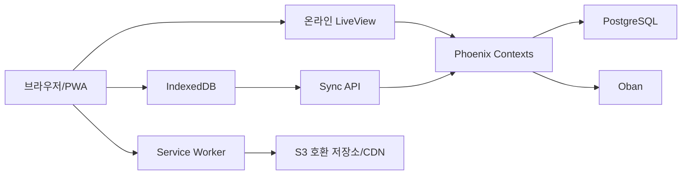

# JLPT 다국어 학습 서비스 제품·구현 기준서

- 문서 상태: 구현 전 기준선
- 정리일: 2026-07-13
- 대상: 이 저장소의 전체 제품·구현 범위
- 상위 규범: [프로젝트 헌법](../.specify/memory/constitution.md)
- 최초 제안서: Codex 첨부 `pasted-text.txt`
- 상세 근거: 로컬 gstack 제품·기술 검토본
- 테스트 근거: 로컬 gstack 엔지니어링 테스트 검토본

## 1. 문서의 역할

이 문서는 최초 기술 제안서와 이후 대화에서 확정한 D1~D41을 하나의 실행 기준으로 합친 문서다. 별도 SOT가 비준되기 전까지 이 문서가 현재 SOT이며, 구현자는 제품 범위와 동작의 정본으로 사용한다. 프로젝트 헌법은 이 문서보다 상위에 있다.

충돌 시 우선순위는 다음과 같다.

1. 프로젝트 헌법
2. 이 문서의 D1~D41과 사용자가 승인해 이 문서 또는 후속 SOT에 반영한 변경
3. 최초 제안서의 명시적 전제
4. 상세 검토본의 기술 권고와 단계별 게이트

대화에서 승인된 변경은 같은 작업에서 이 문서 또는 후속 SOT에 반영해 지속적인 정본으로 만든다.

확정된 사항을 구현 중 다시 제품 질문으로 되돌리지 않는다. FSRS 파라미터, 오프라인 시각 보정, 스키마 호환 창, 캐시 한도, 복구 목표 같은 기술 수치는 테스트와 운영 데이터로 정하고 결과만 보고한다.

현재 사용자 입력을 기다리는 항목은 추후 제공될 자체 제작 콘텐츠 파일뿐이다. 파일을 받기 전에는 카드 뒷면의 세부 필드 배치와 importer 매핑을 추측하지 않는다.

### 1.1 정식 출시 전 파킹 페이지

정식 제품 구현 전 `jlptvoca.com` 도메인의 소유와 향후 용도를 명확히 알리는
임시 파킹 페이지를 먼저 공개한다. 이 표면은 제품 Phase 완료나 학습 기능
출시로 간주하지 않으며, 정식 Phoenix 애플리케이션이 배포되면 제거한다.

범위:

- 공개 GitHub 저장소의 GitHub Pages에 프레임워크 없는 정적 파일로 배포한다.
- 파킹 페이지에서만 영어 `en`, 베트남어 `vi`, 인도네시아어 `id`를 제공한다.
  정식 제품의 한국어 포함 `ko|en|vi|id` 계약은 변경하지 않는다.
- `/`는 저장된 명시적 선택과 브라우저 언어를 기기 안에서만 확인하는
  `x-default` 진입점이며, 실제 언어 페이지는 `/en/`, `/vi/`, `/id/`다.
- 지원하지 않는 브라우저 언어와 감지 실패는 영어로 이동한다. 지원 언어의
  누락 문구를 영어로 조용히 대체하는 동작은 허용하지 않는다.
- 모든 페이지에 텍스트 언어 전환, 언어별 metadata, canonical, 상호
  `hreflang`, `x-default`를 제공하고 파킹 기간에는 `noindex`를 유지한다.
- 쿠키, 계정, 학습 기능, 입력 폼, 광고, 분석, 외부 추적, 외부 폰트와
  서비스 워커를 포함하지 않는다.
- 시스템 폰트와 작은 로컬 정적 자산만 사용하고 키보드 focus, 200% 확대,
  고대비와 reduced motion을 지원한다.

Acceptance criteria:

1. `vi-*`, `id-*`, `en-*` 브라우저 언어와 유효한 저장 선택을 allowlist로
   결정하며 그 밖의 값은 영어로 안전하게 수렴한다.
2. JavaScript가 없거나 저장소 접근이 차단되어도 영어 안내와 세 언어 링크를
   사용할 수 있다.
3. 세 언어 HTML은 승인 대상 문구를 각각 완전하게 포함하고 번역 key 누락
   없이 독립적으로 표시된다.
4. 320 CSS px, 200% 확대, 키보드, screen reader, 고대비와 reduced motion에서
   핵심 안내와 언어 전환을 잃지 않는다.
5. 자동화 테스트가 locale 분기와 정적 artifact 계약을 검증하고 JavaScript
   line·branch coverage 80% 이상을 충족한다.
6. GitHub Actions는 `parking/`만 Pages artifact로 배포하며 저장소 문서와
   미완성 애플리케이션 파일을 웹 루트에 섞지 않는다.

## 2. 한 문장 제품 정의

영어·베트남어·인도네시아어·한국어 설명을 제공하는 무료 JLPT 웹/PWA 서비스로, 자체 제작 어휘를 Anki식 카드로 학습하고 FSRS가 복습 일정을 자동 관리하며, 저데이터·불안정 네트워크에서도 제한적 오프라인 복습을 지원하고 Google AdSense로만 수익화한다.

## 3. 제품 원칙

### 3.1 사업과 사용자 경험

- 제품의 중심은 검색 트래픽이 아니라 반복 사용하는 학습 도구다.
- 핵심 지표는 학습 완료, 반복 복습, 재방문과 실제 회상 유지다.
- SEO 공개 콘텐츠는 사용자 획득 채널이고 광고는 수익화 계층이다.
- 사용자 세분화 설문이나 사전 앙케이트를 요구하지 않는다.
- 첫 진입에서 설명 언어와 응시 레벨만 선택하고 바로 체험한다.
- 내부 알고리즘, 레벨별 비중과 복습 파라미터를 일반 사용자에게 노출하지 않는다.

### 3.2 제공 범위

- 제공 언어: 영어 `en`, 베트남어 `vi`, 인도네시아어 `id`, 한국어 `ko`
- JLPT 레벨: N5, N4, N3, N2, N1
- 첫 통합 기준선: 한국어 N5 단방향 어휘 카드
- 제공 플랫폼: 모바일·PC 반응형 웹과 설치 가능한 PWA
- 전체 완성 범위: 어휘 카드, 공개 SEO 콘텐츠, 오디오, 오프라인 복습, 계정 동기화, 광고, 운영 도구, 후속 문제 연습과 모의시험

### 3.3 현재 범위 밖

- 미얀마어
- Android·iOS 네이티브 앱과 별도 네이티브 코드베이스
- 결제, 구독, 인앱구매, 프리미엄 등급과 광고 제거 상품
- 소셜, 친구, 리더보드, 커뮤니티
- 학습자 생성·업로드 콘텐츠와 공개 사용자 덱
- 사용자별 FSRS 고급 설정과 수동 파라미터 편집
- 로마자 표기와 로마자 설정
- 초기 Google 외 소셜 로그인 UI
- 서로 다른 소셜 로그인 계정의 연결·병합
- 초기 출시의 유형별 문제 연습과 시간 제한 모의시험

문제 연습과 모의시험은 삭제한 기능이 아니라 카드 학습 안정화 이후의 별도 페이즈다.

## 4. 핵심 사용자 흐름

### 4.1 첫 방문과 비로그인 체험

1. 브라우저 언어를 바탕으로 설명 언어를 제안한다.
2. 사용자가 설명 언어와 첫 응시 레벨을 선택한다.
3. 설문 없이 10장의 어휘 카드 체험을 시작한다.
4. 카드는 `앞면 → 답 공개 → 몰랐음/알았음` 순서로 진행한다.
5. 체험 완료 후 Google 회원가입 CTA를 표시한다.

비로그인 진도 규칙:

- 현재 탭의 체험 세션 한 개만 `sessionStorage`에 보관한다.
- 새 체험을 시작하면 이전 비로그인 체험 결과는 폐기한다.
- 탭이나 브라우저를 닫으면 체험 토큰과 가져오기 가능성이 사라진다.
- 비로그인 상태에는 장기 복습 큐, 전체 오프라인 팩과 다중 기기 동기화를 제공하지 않는다.
- 회원가입 시 현재 체험 세션의 10카드 review event만 한 번 가져온다.
- 과거 비로그인 시도는 검색·복구·합산하지 않는다.
- `trial_import_id` 고유키로 재시도 시 중복 반영을 막는다.

### 4.2 Google 회원가입

- 초기 인증 공급자는 Google 하나다.
- 비밀번호와 Magic Link는 사용하지 않는다.
- Google에서는 안정적인 `sub`와 확인된 이메일만 저장한다.
- 이름, 프로필 사진, Google access token과 refresh token은 보존하지 않는다.
- 식별 키는 이메일이 아니라 `(provider, provider_subject)`다.
- 이후 Apple 등 다른 공급자를 추가하더라도 동일 인물을 별도 계정으로 취급한다.
- 계정 연결·병합 UI와 API는 만들지 않는다.

가입 완료 전에 사용자는 `ko|en|vi|id` 중 계정의 `learning_locale`을 선택한다. 이 값은 설명 언어이며 국적이나 모국어 추정값이 아니다. 한번 확정하면 사용자와 운영자 모두 변경할 수 없다.

국가 정보는 수집하지 않는다.

### 4.3 레벨 선택

- 계정에는 `included_levels`로 N5~N1 중 하나 이상을 저장한다.
- 가입 시 처음 선택한 응시 레벨 하나만 켠다.
- 이후 사용자는 레벨별 토글로 원하는 레벨을 추가하거나 제거할 수 있다.
- 최소 한 레벨은 항상 켜져 있어야 한다.
- 변경은 다음 세션부터 적용하고 진행 중 세션은 바꾸지 않는다.
- 레벨을 꺼도 진도, FSRS 상태, 오프라인 데이터와 `due_at`은 삭제하거나 정지하지 않는다.
- 꺼진 레벨의 신규 카드, 복습과 알림은 숨긴다.
- 다시 켜면 밀린 복습을 표시하고 기존 상태에서 계속한다.

### 4.4 홈과 오늘의 학습

홈은 사용자의 현재 상태에 따라 주요 CTA 하나를 우선한다.

```text
완전 신규       -> 가입 없이 10카드 체험
진행 중 세션    -> 이전 세션 계속
복습 예정 있음  -> 오늘의 복습
복습 예정 없음  -> 다음 신규 카드 학습
동기화 문제     -> 학습 CTA 유지 + 복구 안내
```

사용자에게 내부 FSRS 점수와 레벨별 배분 비율을 보여주지 않는다. 카드에는 실제 `content_level` 배지만 간단히 표시한다.

## 5. Anki식 카드 학습과 FSRS

### 5.1 note와 card

- `note`는 일본어 표기, 읽기, 뜻, 예문, 오디오, 레벨 같은 원본 학습 데이터다.
- `card`는 실제 복습되는 앞면과 뒷면의 한 쌍이다.
- note와 card를 분리해 콘텐츠 필드가 늘어나도 기존 카드 ID와 FSRS 진도를 유지한다.

초기 어휘 note에서는 카드 한 장만 생성한다.

```text
앞면: 일본어
답 공개
뒷면: 계정의 설명 언어로 된 뜻
평가: 몰랐음 | 알았음
```

- 뜻→일본어 역방향 카드는 초기에는 만들지 않는다.
- 읽기, 예문, 오디오와 부가 설명의 뒷면 배치는 추후 제공되는 콘텐츠 파일을 확인한 뒤 확정한다.
- 한 note당 초기 카드가 한 장이므로 sibling card 분리 규칙은 적용하지 않는다.
- 향후 다중 카드 template을 도입할 경우 기존 카드와 진도를 유지하고 sibling 연속 노출을 방지한다.

### 5.2 2버튼 평가

- `몰랐음`은 FSRS `Again(1)`으로 기록한다.
- `알았음`은 FSRS `Good(3)`으로 기록한다.
- `Hard(2)`와 `Easy(4)`는 UI에 표시하지 않고 초기 event로 허용하지 않는다.
- 반응 시간으로 Hard/Easy를 추측하지 않는다.
- 사용자가 답을 직접 평가하므로 객관식 자동 채점 결과를 카드 rating으로 변환하지 않는다.

### 5.3 FSRS 계약

- 초기 알고리즘: FSRS-6
- 초기 desired retention: `0.90`
- 각 카드는 `state`, `due`, `last_review`, `stability`, `difficulty`, lapse/review count를 독립적으로 가진다.
- 모든 review event에 FSRS 버전과 parameter version을 기록한다.
- 서버가 원본 event를 fold해 계산한 snapshot이 정본이다.
- 브라우저가 보낸 due, stability, difficulty와 다음 간격은 신뢰하지 않는다.
- 브라우저는 오프라인에서 고정된 `ts-fsrs`로 임시 일정을 계산한다.
- 서버는 `fsrs-rs`를 격리된 adapter 뒤에서 사용하고 브라우저 구현과 golden fixture를 공유한다.
- 충분한 review history가 생기기 전에는 공식 기본 파라미터를 사용한다.
- 자동 최적화는 holdout 지표가 실제로 개선될 때만 새 parameter version을 활성화한다.
- FSRS 버전 업그레이드는 event replay, 마이그레이션, 교차 런타임 parity와 canary를 통과해야 한다.

사용자와 콘텐츠 소유자는 카드별 복습 수, 비율이나 FSRS 파라미터를 일일이 지정하지 않는다.

### 5.4 신규·복습 자동 배분

- FSRS 예정 복습량과 일일 학습 예산으로 관리 가능한 세션 묶음을 자동 생성한다.
- 전체 밀린 양은 숨기지 않되 한 번에 감당할 수 있는 묶음으로 나눈다.
- 고정 `20개` 같은 값을 사용자에게 설정하게 하지 않는다.
- 운영 설정에는 폭주 방지용 전역 최소·최대 guardrail만 둔다.
- 진행 중인 세션의 카드 구성은 바꾸지 않는다.

여러 레벨이 켜진 경우:

1. 가장 쉬운 미완료 레벨의 신규 어휘 카드를 우선한다.
2. 해당 레벨의 신규 카드가 부족할 때만 다음 난도에서 부족분을 채운다.
3. 상위 레벨 카드에는 실제 레벨 배지를 표시한다.
4. 처음 학습한 카드는 출제 경로가 아니라 원래 `content_level`의 진도에 반영한다.

### 5.5 다음 레벨 추천

추천은 자동 활성화가 아니라 사용자 확인을 받는 알림이다.

- `shortage_suggestion`: 현재 최고 난도 레벨의 남은 신규 어휘가 부족할 때
- `mastery_suggestion`: 신뢰 가능한 review history와 FSRS 기억 상태가 안정적일 때
- 추천 범위: 현재 최고 난도의 바로 위 한 단계
- N1에서는 상향 추천하지 않는다.
- 알림에는 대상 레벨과 `남은 신규 카드가 적음` 또는 `현재 레벨을 충분히 익힘` 같은 평이한 이유만 표시한다.
- 사용자가 `포함`을 선택해야 해당 레벨 토글을 켠다.
- `나중에`를 선택하면 자동으로 레벨을 켜지 않는다.

숙련도 추천을 수락한 뒤 상위 신규 카드 수는 FSRS 복습 부하와 회상 상태로 자동 계산한다. 성과가 나빠지면 상위 신규 카드만 `active -> reduced -> paused`로 줄이거나 멈추고, 회복되면 자동으로 점진 재개한다. 이미 배운 상위 카드의 복습은 유지한다.

### 5.6 미니 팩과 전체 팩

- 새 상위 레벨을 켜면 작은 미니 팩으로 바로 시작할 수 있다.
- 미니 팩은 별도 복제 콘텐츠가 아니라 전체 팩과 같은 `content_id`, `content_version`과 asset hash를 참조한다.
- 전체 팩 설치 시 받은 자산과 진도를 그대로 재사용한다.
- 동일 카드를 신규 카드로 중복 생성하지 않는다.
- content-addressed cache와 reference count로 미니 팩과 전체 팩의 공유 자산을 안전하게 관리한다.

## 6. 오디오와 표기

### 6.1 오디오

- 기본은 상업 이용 가능한 TTS로 사전 생성한 정적 오디오다.
- 런타임 외부 TTS 호출과 반복 스트리밍을 하지 않는다.
- 발음·억양 구별이 중요한 항목만 원어민 녹음을 사용할 수 있다.
- 텍스트·카드 팩과 오디오 팩을 분리한다.
- 텍스트 팩은 기본 오프라인 자산으로 제공한다.
- 오디오 팩은 예상 크기를 보여준 뒤 사용자가 별도로 내려받는다.
- 모바일 데이터에서는 자동 다운로드와 백그라운드 오디오 갱신을 금지한다.
- 변경되지 않은 오디오는 hash로 재사용한다.
- 오디오는 자동 재생하지 않는다.
- 속도는 `0.75x`, `1.0x`, `1.25x`를 제공하고 기본은 `1.0x`다.
- 사용자가 선택한 속도는 기기에 저장한다.

오디오 provenance에는 공급자, 음성 모델, 생성일, 상업 이용 조건, 원문 hash와 소유자의 품질 확인 상태를 기록한다.

### 6.2 후리가나와 로마자

- N5·N4는 후리가나 기본 켜짐
- N3·N2·N1은 후리가나 기본 꺼짐
- 사용자는 학습 중 후리가나를 전환할 수 있다.
- 선택 상태는 기기에 저장한다.
- 로마자 표기, 로마자 설정과 로마자 콘텐츠 필드는 제공하지 않는다.

## 7. 오프라인 PWA

### 7.1 역할 분리



- 온라인 화면과 세션 셸은 LiveView가 담당한다.
- 카드 뒤집기, 답 공개, 평가와 오프라인 플레이어는 작은 TypeScript `ReviewPlayer`가 담당한다.
- Service Worker는 앱 자산과 불변 팩의 전송·캐시를 담당한다.
- IndexedDB는 팩, 카드, 임시 FSRS 상태와 전송 대기 event를 보관한다.
- LiveView 자체를 오프라인에서 실행하려 하지 않는다.

### 7.2 오프라인 가능 범위

가능:

- 내려받은 텍스트·카드 팩 복습
- 받은 오디오 재생
- 답 공개와 2버튼 평가
- 임시 FSRS 일정 계산
- review event outbox 저장
- 재연결 후 서버 동기화

불가능:

- 새 콘텐츠 검색
- 새 팩과 오디오 다운로드
- 여러 기기 간 즉시 동기화
- 계정 변경
- 광고 요청
- 최신 서버 통계

### 7.3 동기화 불변식

- 학습 event는 append-only다.
- `(device_id, client_event_id)` 고유키로 중복 반영을 막는다.
- 온라인과 오프라인 모두 `ReviewPlayer -> outbox -> ingest -> fold -> snapshot` 경로를 사용한다.
- 앱은 온라인 event, LiveView 재연결, 세션 완료, 앱 시작과 수동 재시도 때 동기화를 시도한다.
- Background Sync만 유일한 전송 수단으로 사용하지 않는다.
- 서버는 event별 승인·영구 거부·재시도 가능 오류를 구분해 반환한다.
- 잘못된 event 하나가 전체 batch의 정상 event를 막지 않는다.
- 동기화 실패를 숨기지 않고 사용자에게 상태와 복구 방법을 보여준다.
- 앱 N은 우선 팩·IndexedDB N과 N-1을 읽도록 검증한다.
- 지원하지 않는 schema를 만나도 사용자 데이터를 자동 삭제하지 않는다.

## 8. 알림과 콘텐츠 신고

### 8.1 복습 알림

- 앱 홈에서 오늘의 복습을 항상 보여준다.
- 로그인 사용자가 명시적으로 동의한 경우에만 Web Push를 사용한다.
- 첫 방문이나 비로그인 체험 중에는 브라우저 알림 권한을 요청하지 않는다.
- 푸시는 기본 꺼짐이며 앱 설정과 브라우저에서 해제할 수 있다.
- 카드별로 보내지 않고 사용자 시간대의 복습 묶음 단위로 제한한다.
- 발송 직전에 완료된 복습과 꺼진 레벨을 다시 제외한다.
- payload에는 이메일, 정답·오답과 상세 학습 이력을 넣지 않는다.
- 이메일 알림은 후속 페이즈다. 구현 시 별도 opt-in, 빈도, 해지와 반송 정책을 먼저 확정한다.

### 8.2 콘텐츠 오류 신고

- 로그인 사용자만 신고할 수 있다.
- 비로그인 화면에는 신고 제출 기능을 제공하지 않는다.
- 신고 유형: 오탈자, 정답·해설, 번역, 레벨 분류, 오디오, 기타
- 신고는 콘텐츠를 자동 수정하거나 게시 상태를 바꾸지 않는다.
- 신고자는 다른 사용자의 신고와 개인정보를 볼 수 없다.
- 소유자만 신고 큐를 보고 `received -> reviewing -> resolved|rejected` 상태를 변경한다.
- 수정이 필요하면 기존 게시 버전을 고치지 않고 새 콘텐츠 버전을 만든다.

## 9. 콘텐츠 공급망과 운영 권한

### 9.1 콘텐츠 원칙

- 학습 콘텐츠는 전부 자체 제작한다.
- 외부 사전·JLPT 목록을 생산 데이터의 기반으로 사용하지 않는다.
- 자체 분류를 `공식 JLPT 목록`이라고 표현하지 않는다.
- 제공 파일을 받으면 구조, 중복, 레벨, 소유권, 번역 상태를 먼저 감사한다.
- 게시된 콘텐츠 버전은 불변이며 수정은 새 버전으로 만든다.
- 앱 배포와 콘텐츠 release·rollback은 독립적으로 수행한다.

모든 콘텐츠에는 다음 provenance를 기록한다.

- 자체 제작자, 작성일, 원본 식별자와 소유권 근거
- 참고 자료와 실제 사용 범위
- 상업 이용·수정·재배포 조건
- 필요한 귀속
- 가져온 시점과 변형 내역
- JLPT 레벨 부여 근거
- 외부 검토 근거가 있다면 해당 기록
- 삭제·정정 요청과 파생 자료 영향

### 9.2 단일 콘텐츠 소유자

- 사용자 본인에게만 `content_owner` 권한을 부여한다.
- 생성, 업로드, 수정, 승인, 게시와 롤백을 이 계정만 수행한다.
- 일반 사용자와 광고 운영 계정에는 콘텐츠 쓰기 권한이 없다.
- 외부 전문가는 시스템 밖 피드백이나 읽기 전용 자료만 사용할 수 있다.
- 실제 반영과 품질 상태 기록은 소유자만 수행한다.
- 애플리케이션 UI에서 content_owner 권한을 스스로 추가할 수 없다.
- 모든 콘텐츠·권한 변경은 감사 로그에 남긴다.

운영 흐름:

```text
소유자 업로드
  -> 서버 dry-run
  -> 행별 오류와 reject 파일
  -> 변경·귀속 diff
  -> 소유자 편집과 자동 저장
  -> 품질·권리 검사
  -> 웹·오디오·팩 미리보기
  -> 소유자 승인
  -> 불변 release 생성
  -> active pointer 전환
  -> 모니터링
  -> 필요 시 이전 pointer로 rollback
```

### 9.3 번역 상태

```text
draft -> machine_assisted -> human_reviewed -> approved -> published
  ^              |                 |              |
  |              +---- rejected ---+              +---- superseded
  +--------------------- needs_revision ----------------+
```

- 기계 번역은 초안 보조이며 게시 기준이 아니다.
- 모든 상태 전이는 content_owner만 수행한다.
- `human_reviewed`는 외부 사용자에게 편집 권한을 준다는 뜻이 아니라 소유자가 검토 근거를 기록한 상태다.
- 원문이 바뀌면 승인된 번역도 `needs_revision`으로 바꾼다.
- 준비되지 않은 언어를 다른 언어로 조용히 대체하지 않는다.

## 10. 광고·수익·개인정보

### 10.1 수익 모델

- 서비스는 계속 무료로 제공한다.
- 수익 공급자는 Google AdSense로 제한한다.
- 결제·청구·구독·entitlement 인프라는 만들지 않는다.
- 광고 제거 상품은 현재와 장래 범위에 없다.
- 모든 AdSense 요청은 비개인화 광고를 사용한다.
- 관심 기반 targeting과 remarketing을 하지 않는다.

### 10.2 광고 위치

초기 활성 위치:

- 공개 콘텐츠·SEO 페이지
- 학습 세션 결과 화면

초기 비활성 위치:

- 카드 학습 화면
- 카드 앞면과 뒷면
- 답 공개와 `몰랐음/알았음` 버튼 주변
- 로그인, 설정, 개인정보, 계정 삭제
- 오프라인 화면

광고 위치는 코드로 정의한 안정적인 `slot_id` registry에서 관리한다. 소유자는 등록된 슬롯을 운영 화면에서 개별 on/off할 수 있고 전역 kill switch를 사용할 수 있다. 임의 CSS selector와 임의 광고 코드는 허용하지 않는다. 변경자, 시각, 이전값과 새값을 감사 로그에 남긴다.

### 10.3 전체 화면 광고와 Offerwall

- AdSense Vignette를 일반 슬롯과 별도로 지원한다.
- 몇 초 시청 후 콘텐츠 접근을 제공하는 경우 Google 공식 Offerwall/Rewarded ad만 사용한다.
- 자체 타이머, 가짜 닫기 버튼과 임의 전체 화면 광고는 만들지 않는다.
- Vignette와 Offerwall은 형식별·페이지별 스위치와 전역 kill switch를 가진다.
- Offerwall은 구현하되 초기에는 비활성화한다.
- 적용 URL, metering과 무료 통과 횟수는 운영 설정으로 관리한다.
- 로그인, 개인정보, 약관, 계정 삭제 같은 필수 기능을 Offerwall로 막지 않는다.
- 활성화 전 정책, 이탈률, 수익과 저데이터 환경 게이트를 통과해야 한다.

### 10.4 CMP와 광고차단

- 연령을 묻지 않는 일반 대상 JLPT 서비스로 운영한다.
- 필요한 지역에는 Google 인증 CMP를 적용한다.
- 동의 거부·미확정 상태도 핵심 학습을 막지 않는다.
- 광고차단을 우회하거나 차단기를 속이지 않는다.
- 광고 script 요청·로드·실패와 slot 상태만 최소한으로 관측한다.
- 재방문·학습 3회 이상이며 광고 로드가 반복 실패한 사용자에게만 닫을 수 있는 안내를 한 번 표시할 수 있다.
- 안내는 카드 학습과 필수 계정 기능을 막지 않는다.

## 11. 기술 구조

### 11.1 기본 스택

| 계층 | 선택 |
|---|---|
| 런타임 | Elixir / Erlang OTP, 구현 착수 시 호환 보안 패치 고정 |
| 웹 | Phoenix 1.8 단일 애플리케이션, Bandit |
| 상호작용 UI | Phoenix LiveView |
| 공개 페이지 | Controller/HEEx 중심, 필요한 부분만 LiveView |
| 스타일·JS | Tailwind CSS, esbuild, 작은 TypeScript hook/module |
| 데이터베이스 | PostgreSQL |
| 작업 큐 | Oban |
| PWA | Workbox `injectManifest`, Service Worker, IndexedDB |
| 저장소 | S3 호환 객체 스토리지 + CDN |
| 테스트 | ExUnit, LiveViewTest, Playwright, 실제 브라우저 저장소 |
| 관찰 | Telemetry, 구조화 로그, 오류 추적, 기본 메트릭 |
| 배포 기준 | Singapore 단일 리전에서 시작, 관리형 PostgreSQL |

초기에 React, Vue, Next.js, Redis, Elasticsearch, Kafka, Kubernetes, 마이크로서비스와 별도 콘텐츠 API 서버를 도입하지 않는다.

### 11.2 애플리케이션 경계

| Context | 책임 |
|---|---|
| `Catalog` | note, card template, 번역, 출처, 라이선스, 오디오, release와 pack manifest |
| `Learning` | profile, session, review event ingest, FSRS fold, snapshot과 복습 큐 |
| `Accounts` | 사용자, social identity, trial, 1회 가져오기, 기기, 동의와 삭제 |

광고는 Web 계층의 정책·공급자 adapter로 둔다. 동기화 Controller와 Oban worker는 Context 함수를 호출하는 얇은 adapter로 유지한다.

### 11.3 핵심 데이터 불변식

- 게시 content version은 수정하지 않는다.
- 번역은 content version에 종속된다.
- note와 card를 분리하고 card ID를 안정적으로 유지한다.
- review event는 append-only다.
- snapshot은 event에서 다시 계산할 수 있는 파생 데이터다.
- trial import는 반복 호출과 중간 실패에도 한 번만 반영된다.
- pack은 schema version, content version과 checksum을 가진다.
- 운영 변경은 행위자, 시각, 이전값, 새값과 이유를 기록한다.

초기 데이터 영역:

```text
content_notes, content_versions, card_templates, cards
translations, glossary_terms, examples, audio_assets
content_sources, license_records, content_reports
users, social_identities, learning_profiles, devices
trial_sessions, trial_events, trial_imports
learning_events, card_state_snapshots, progress_snapshots
review_queue, fsrs_parameter_sets
content_packs, pack_members, publish_runs
ad_slot_settings, consent_records, audit_logs
```

### 11.4 URL과 캐시

- 모든 공개 URL에 `en|vi|id|ko` locale을 명시한다.
- locale은 allowlist로 검증한다.
- canonical, hreflang, sitemap과 언어별 metadata를 제공한다.
- 개인 결과와 검색·필터 중복 페이지는 `noindex`로 처리한다.
- 인증·개인화 HTML은 `private, no-store`로 처리한다.
- LiveView socket, sync API, AdSense와 CMP 요청은 Service Worker가 캐시하지 않는다.
- 불변 JS·CSS·아이콘, versioned pack과 선택형 오디오는 적절한 CacheFirst 전략을 사용한다.

### 11.5 보안과 개인정보

- OAuth/OIDC의 state, nonce, issuer, audience와 서명을 검증한다.
- CSRF, CSP, HSTS, 보안 쿠키와 권한 정책을 적용한다.
- 모든 업로드, event와 URL 파라미터를 schema로 검증한다.
- sync batch의 event 수, byte, 빈도, 시각 범위와 pack version을 제한한다.
- 검색, 로그인, sync, 콘텐츠 신고와 오디오 경로에 서로 다른 rate limit을 적용한다.
- HTML이 필요하면 allowlist로 정화하고 가능하면 구조화 데이터로 저장한다.
- 비밀은 환경변수나 비밀 관리 서비스로 주입하고 시작 시 검증한다.
- 사용자에게 데이터 내보내기와 삭제 기능을 제공한다.
- 로그와 진단 bundle에서 token, 이메일과 상세 학습 답변을 제거한다.

## 12. 구현 페이즈와 확인 게이트

각 페이즈가 끝날 때 다음 네 가지를 보고한다.

1. 완료한 기능과 실제 동작 증거
2. 자동화 테스트·접근성·성능·보안 결과
3. 발견한 우려와 같은 페이즈에서 수정한 내용
4. 다음 페이즈 진입 가능 여부

사용자는 이 체크포인트에서 범위 변경이 필요한지만 판단한다. 구현 세부 수치와 정상적인 엔지니어링 선택을 일일이 승인하지 않는다.

### Phase 0. 확정사항 잠금과 측정 계약

구현:

- 이 문서와 D1~D41을 acceptance criteria로 고정
- learner-first 지표, event와 dashboard 계산식 정의
- 광고 없는 beta와 AdSense pilot의 측정 항목 정의
- 첫 출시 계약을 `웹/PWA + 한국어 N5 단방향 어휘 + 2버튼 FSRS`로 고정

확인 단계:

- 불필요한 사용자 질문 없이 `설명 언어 -> JLPT 레벨 -> 체험` 흐름이 완결되는가
- 확정사항과 보류사항이 분리되어 있는가
- 기술 기본값이 사용자 결정 목록에 섞이지 않았는가

통과 기준: 이 문서와 테스트 추적표에 모순과 미분류 요구가 없다.

### Phase 1. 자체 콘텐츠 감사와 importer 설계

선행: 사용자가 자체 제작 콘텐츠 파일을 제공한다.

구현:

- 원본 보존과 digest 계산
- 구조, 중복, 레벨, 권리, 번역과 오디오 상태 감사
- 정규 note schema와 mapping table
- dry-run/apply가 같은 검증 코드를 쓰는 importer
- 행별 오류와 reject report
- provenance·license ledger

확인 단계:

- dry-run DB write가 0인가
- 같은 입력을 반복 적용해도 중복 note·card·release가 생기지 않는가
- 첫 카드 앞면·뒷면 필드가 실제 파일로 확정되었는가
- 최소 한국어 N5 샘플이 품질·권리 게이트를 통과하는가

통과 기준: 합법적이고 재현 가능한 한국어 N5 seed와 importer fixture가 있다.

### Phase 2. Phoenix 기반과 핵심 계약

구현:

- Phoenix 모놀리스, PostgreSQL, Oban과 CI
- Catalog/Learning/Accounts 경계
- Google OIDC 경계와 content_owner 권한
- note/card, event, snapshot, sync와 pack schema
- ReviewPlayer 상태 머신
- FSRS server/browser adapter와 golden fixture
- 관찰 가능성, 비밀 검증과 보안 기본값
- `doctor`, `setup`, `dev`, `check` 개발 명령

확인 단계:

- 새 macOS/Linux 환경에서 문서대로 앱·DB·테스트를 실행할 수 있는가
- 잘못된 rating, event, pack과 권한 없는 운영 요청을 거부하는가
- online/offline FSRS 계산이 동일 fixture에서 일치하는가
- 콘텐츠 소유자가 터미널 없이 draft부터 rollback까지 완료할 수 있는가

통과 기준: `bin/check --all`과 핵심 계약 테스트가 모두 통과한다.

### Phase 3. 한국어 N5 온라인 어휘 기준선

구현:

- 한국어 N5 공개 허브·어휘 상세·검색
- 10카드 비로그인 체험
- Anki식 앞면·답 공개·2버튼 평가
- FSRS 복습 큐와 자동 세션 분할
- 레벨 토글과 다음 레벨 추천의 기본 계약
- 결과 화면과 콘텐츠 소유자 운영 흐름

확인 단계:

- 공개 콘텐츠부터 체험 완료까지 E2E가 통과하는가
- Again/Good만 기록되고 double-tap이 중복 event를 만들지 않는가
- 로딩, 빈 상태, 연결 끊김과 오류 복구가 보이는가
- 모바일 접근성, SEO와 Core Web Vitals 기준을 충족하는가

통과 기준: 한국어 N5 온라인 카드 학습의 전체 쓰기 경로가 event 하나도 잃지 않는다.

### Phase 4. 오프라인 PWA와 결정적 동기화

구현:

- 설치 가능한 PWA와 Service Worker
- 텍스트 팩 다운로드·검증·원자 활성화·삭제
- 선택형 오디오 팩
- IndexedDB outbox와 오프라인 ReviewPlayer
- 재연결, 두 탭·다중 기기와 서비스 워커 업데이트 처리

확인 단계:

- 부분 다운로드나 checksum 실패 시 이전 팩이 계속 동작하는가
- 네트워크 전환·중복 전송·재시도에도 진도 손실과 중복이 없는가
- 저장공간 부족·손상·schema 불일치에서 데이터를 조용히 삭제하지 않는가
- 모바일 데이터에서 오디오 자동 다운로드가 발생하지 않는가

통과 기준: 온라인·오프라인 replay가 같은 서버 snapshot으로 수렴한다.

### Phase 5. 회원 진도·알림·신고·개인정보

구현:

- Google 회원가입과 learning_locale 확정
- 현재 trial의 1회 가져오기
- 회원 기기 관리, 데이터 내보내기와 삭제
- 앱 내부 복습 표시와 opt-in Web Push
- 로그인 회원 전용 콘텐츠 신고와 소유자 처리 큐

확인 단계:

- trial import가 실패·재시도에서도 정확히 한 번 반영되는가
- 동일 이메일의 다른 provider가 별도 계정으로 남는 계약이 있는가
- push 거부·해제가 학습을 막지 않는가
- 비로그인 신고와 권한 없는 콘텐츠 변경을 거부하는가
- 삭제·보존 정책이 DB, 저장소, 로그와 backup에 실제로 적용되는가

통과 기준: 계정·알림·신고 경계에 권한 상승과 개인정보 누출이 없다.

### Phase 6. 영어·베트남어·인도네시아어 N5

언어별로 순차 반복한다.

구현:

- UI Gettext와 DB 콘텐츠 번역
- 타이포그래피, 검색 정규화와 screen reader 처리
- locale별 공개 URL, canonical, hreflang과 sitemap
- 언어별 텍스트·오디오 팩

확인 단계:

- 번역 누락 시 다른 언어로 조용히 대체하지 않는가
- 긴 영어·인도네시아어, 베트남어 발음부호와 한국어 줄바꿈이 안전한가
- 언어별 콘텐츠 품질과 소유자 승인 상태가 완결되었는가

통과 기준: 각 언어는 독립적으로 모든 품질 게이트를 통과한 뒤 공개한다.

### Phase 7. AdSense와 운영 강화

구현:

- Google 인증 CMP와 비개인화 광고
- slot registry, 페이지 허용 목록과 전역 kill switch
- 공개 페이지 pilot 후 결과 화면 슬롯
- Vignette 단계적 활성화
- Offerwall/Rewarded ad 통합, 초기 비활성화
- 광고 상태·정책·CLS·수익·이탈 관찰
- 광고 로드 반복 실패의 비차단성 1회 안내

확인 단계:

- 카드 학습과 필수 기능에 광고가 나타나거나 접근을 막지 않는가
- slot 중복 초기화와 자동 새로고침이 없는가
- 동의 상태가 정해지기 전 광고 요청이 없는가
- 정책 경고, 레이아웃 이동과 유지율 악화 시 kill switch가 즉시 동작하는가

통과 기준: 정책 경고 없이 성능·접근성 예산을 유지하고 수익 데이터를 비교할 수 있다.

### Phase 8. N4에서 N1까지 어휘 완성

구현:

레벨별로 콘텐츠 공급망, 네 언어, 공개 SEO, 온라인 카드, 오프라인 팩, 계정 동기화와 광고 허용 페이지를 반복한다.

확인 단계:

- 각 레벨의 provenance·license 누락이 0건인가
- 레벨 토글 off/on에서 FSRS 진도와 due가 유지되는가
- 미니 팩에서 전체 팩으로 바꿀 때 자산·카드·진도가 중복되지 않는가
- shortage/mastery 추천이 인접 레벨만 제안하고 N1에서 멈추는가
- 상위 신규 카드의 reduce/pause/resume가 기존 복습을 손상하지 않는가

통과 기준: N5~N1 어휘가 네 언어에서 동일 계약으로 동작한다.

### Phase 9. 유형별 문제 연습과 시간 제한 모의시험

구현:

- 한자·문법·독해·청해 schema와 문제 renderer
- 문제 set, 답안, 해설, 부분점수와 이동 상태
- 시간 제한, section 이동, 미응답과 자동 제출 상태 머신
- 문제·시험 전용 event와 결과 분석

확인 단계:

- 동일 시험 seed·답안·시간 event replay가 같은 점수를 만드는가
- 문제 결과가 카드 FSRS rating이나 due를 변경하지 않는가
- 오디오 preload, 연결 중단, 재개와 접근성이 검증되는가

통과 기준: 카드 학습과 시험 모드의 event·진도·분석이 명확히 분리된다.

### Phase 10. 정식 운영 게이트

구현:

- 운영 dashboard, alert와 runbook

확인 단계:

- 전체 브라우저·저사양 Android·접근성 매트릭스
- 부하·용량·비용 예산
- 보안 침투 점검과 dependency 감사
- 개인정보 삭제·보존 검증
- backup restore, 리전 장애, 앱·콘텐츠 독립 rollback 훈련

통과 기준: P0/P1 결함이 없고 정한 SLO·RPO·RTO와 복구 훈련을 실제 증거로 충족한다.

## 13. 테스트 기준

- 모든 기능은 RED → GREEN → REFACTOR 순서의 TDD로 구현한다.
- Elixir와 TypeScript line/branch coverage는 최소 80%다.
- event fold, 중복 ingest, trial import, FSRS rating 검증과 pack 활성화의 위험 분기는 100%를 목표로 한다.

| 계층 | 필수 검증 |
|---|---|
| 단위 | 콘텐츠·번역 상태, Again/Good 매핑, FSRS 상태 전이, note/card 생성, locale 정규화 |
| 통합 | LiveView+DB, Google OIDC, trial import, 레벨 토글, Oban 재시도, content_owner 권한 |
| 계약 | sync API, event schema, pack manifest, N/N-1 호환, server/browser FSRS parity |
| E2E | 체험→가입→가져오기, 온라인→오프라인→재연결, pack 손상 복구, 광고/CMP kill switch |
| 접근성 | 키보드, screen reader, focus, aria-live, 200% 확대, 고대비, reduced motion, ruby |
| 운영 | restore, rollback, 서비스 워커 upgrade, WebSocket drain, secret·dependency 감사 |

결정적 테스트를 위해 시계, UUID, 난수 seed와 network scheduler를 주입한다. 실패 seed는 저장해 CI에서 재현한다.

## 14. 성능·데이터 절약 기준

초기 기준은 저가형 Android와 불안정 네트워크다.

- 시스템 CJK font를 우선하고 대형 webfont를 기본 번들에 넣지 않는다.
- 첫 화면에 필요한 데이터만 내려보낸다.
- LiveView event payload를 작게 유지한다.
- 오디오는 초기 다운로드 0이며 사용자가 요청할 때만 받는다.
- 모바일 한 화면의 일반 광고는 최대 한 슬롯을 기본으로 한다.
- 대형 pack은 chunk 단위로 내려받고 전체를 메모리에 올리지 않는다.
- 저장 용량, 예상 다운로드 크기, 마지막 sync와 삭제 기능을 사용자에게 보여준다.

정확한 byte·latency 예산은 Phase 2에서 실제 build와 기기 측정으로 고정하고 사용자 결정으로 되묻지 않는다.

## 15. 구현 중 자동 확정할 기술 항목

다음은 사용자 승인이 필요한 제품 선택이 아니다.

- offline event의 clock skew 허용 범위와 최대 지연 창
- 앱·pack·IndexedDB의 구체적인 호환·보존 기간
- DB pool, Oban concurrency와 rate limit 수치
- cache quota와 audio eviction 기준
- backup RPO/RTO와 restore runbook 수치
- AdSense pilot 성공·중단 문턱의 구체적인 수치
- FSRS 자동 최적화 시작에 필요한 최소 history와 승격 지표

각 값은 공식 제약, 속성 테스트, 저사양 기기, 장애 주입과 beta 운영 데이터로 정한다. 값이 정해지면 버전과 근거를 문서화한다.

## 16. 콘텐츠 파일 수령 후 확정할 항목

콘텐츠 파일을 받으면 다음 순서로만 추가 결정한다.

1. 원본 형식과 encoding
2. note의 안정적인 원본 식별자
3. 일본어 표기·읽기·sense·뜻·예문·오디오 field mapping
4. 카드 뒷면의 읽기·예문·오디오 배치
5. 중복 판정과 merge 금지·허용 규칙
6. 자체 JLPT level 근거와 충돌 처리
7. 번역 상태와 누락 처리
8. importer dry-run 오류 형식
9. pack 분할 기준과 예상 크기

이 항목은 파일 확인 전에는 사용자에게 반복 질문하지 않는다.

## 17. 결정 대조표

| ID | 확정 내용 |
|---|---|
| D1 | learner-first 학습 제품, SEO는 획득, 광고는 수익화 |
| D2 | 첫 통합 기준선은 한국어 |
| D3 | 사용자 세분화·사전 앙케이트 없음 |
| D4 | 연령 질문 없이 비개인화 AdSense와 필요 지역 CMP |
| D5 | 학습 콘텐츠 전부 자체 제작 |
| D6 | TTS 기본의 혼합형 오디오, 정적 자산 배포 |
| D7 | 텍스트 팩 기본, 오디오 팩 선택 다운로드 |
| D8 | N5·N4 후리가나 기본 on, N3~N1 off, 로마자 없음 |
| D9 | 오디오 수동 재생, 0.75/1.0/1.25 배속 |
| D10 | 비로그인 진도는 현재 체험 세션 한 개만 유지 |
| D11 | 비로그인 체험은 10카드 |
| D12 | 체험은 sessionStorage에만 두고 탭 종료 시 만료 |
| D13 | 소셜 로그인, 초기 Google만, provider 계정 연결 없음 |
| D14 | 광고 슬롯은 유연하게 제어, 초기 공개·결과 화면만 활성 |
| D15 | 사전 정의 슬롯을 운영 화면에서 on/off, 감사 로그 유지 |
| D16 | Vignette와 공식 Offerwall/Rewarded ad 지원 |
| D17 | Offerwall 적용 대상은 pilot 중 결정, 초기 off |
| D18 | Google 저장 최소화, 국가 미수집, learning_locale 변경 불가 |
| D19 | N5~N1 복수 선택 토글, 레벨별 진도 보존 |
| D20 | 켜진 레벨의 신규 카드·복습·알림만 포함 |
| D21 | 꺼진 레벨도 due 시간은 계속 흐름 |
| D22 | 복습 세션 크기는 FSRS 부하로 자동 분할 |
| D23 | 다음 레벨 추천은 신규 잔량과 FSRS 기억 상태로 자동 판정 |
| D24 | 카드 진도는 실제 content_level에 귀속, 레벨 on일 때 복습 |
| D25 | 상위 레벨 미니 팩은 전체 팩과 ID·버전·hash 호환 |
| D26 | 초기 레벨 혼합·추천은 vocabulary만 대상 |
| D27 | 부족분 추천은 즉시, 숙련 추천은 신뢰 가능한 이력부터 |
| D28 | 전역 선행학습 설정 대신 레벨별 토글 |
| D29 | 다음 레벨은 추천 후 사용자 확인으로만 활성 |
| D30 | 복수 레벨 신규 카드는 쉬운 미완료 레벨 우선 |
| D31 | 숙련 추천 수락 후 상위 신규 수는 FSRS로 자동 계산 |
| D32 | 상위 신규 혼합은 성과에 따라 자동 축소·정지·재개 |
| D33 | FSRS-6, desired retention 0.90, versioned automatic optimization |
| D34 | 본인만 콘텐츠 생성·수정·승인·게시·rollback 가능 |
| D35 | 영구 무료, Google AdSense만, 광고 제거·결제 없음 |
| D36 | 초기 알림은 앱 내부 + opt-in Web Push, 이메일은 후속 |
| D37 | 콘텐츠 오류 신고는 로그인 사용자만 가능 |
| D38 | Anki식 앞면→답 공개→몰랐음/알았음 2버튼 FSRS |
| D39 | 초기 어휘 카드는 일본어→뜻 단방향 |
| D40 | 첫 출시는 어휘 카드, 문제·모의시험은 후속 |
| D41 | 제공 플랫폼은 반응형 웹/PWA로 확정, 네이티브 제외 |

## 18. 구현 착수 조건

제품·기술 방향에 관한 추가 결정은 필요하지 않다. 실제 구현 전 필요한 외부 입력은 자체 제작 콘텐츠 파일이며, 파일이 없어도 Phoenix 기반과 계약 테스트의 준비는 가능하지만 Phase 1 콘텐츠 게이트는 파일 수령 후에만 완료할 수 있다.

구현을 시작하면 Phase 0부터 진행하고, 각 페이즈의 확인 자료를 제시한 뒤 다음 페이즈로 넘어간다.
